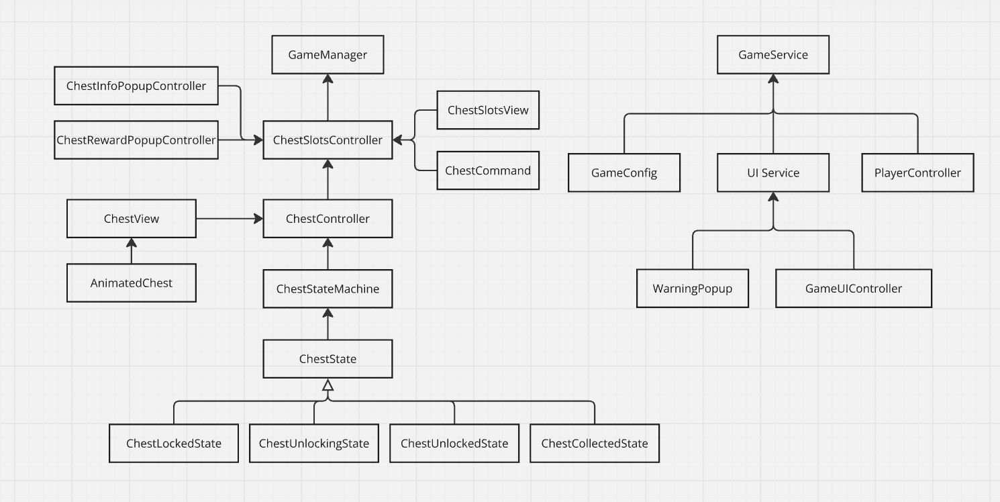

# TradingSystem
### Summary
A scalable game mechanic for in-game trading between player and the shop. 

### Gameplay demo
https://github.com/user-attachments/assets/966ba0fd-18b7-40ee-a14b-3ea8836766d8

## Architecture overview
### Block diagram

### ChestSlotsController
`ChestSlotsController` controls chest slots and managing chests in the chest slots alongside `ChestSlotsView`. Provides interfaces for other parts of the code for adding/removing chests and handling interactions with chest slots. Triggers popups for chest info or reward info. Also serves as a command invoker for `ChestCommand`s.

### ChestController
Manages the chest's appearnce with `ChestView` and contains the `ChestStateMachine`. Provides interfaces for managing chest states and handling user interactions with chests. It contains an instance of `ChestSO` scriptable object.

### ChestView and AnimatedChest
Controlled by the `ChestController`, `ChestView` manages how the chest state is displayed. `ChestView` contains `AnimatedChest`, that defines how the chest looks in the chest view. ChestView uses ans instance of scriptable object `ChestSO` during initialization. `ChestSO` defines chest properties like rarity, appearance, unlock duration etc.

### ChestStateMachine and ChestState
`ChestStateMachine` manages the state of `ChestController` that can assume `ChestLockedState`, `ChestUnlockingState`, `ChestUnlockedState`, `ChestCollectedState`, which implement the interface `ChestState`.

### ChestCommand
Abstract class that implements `ICommand` for chest related commands. `ChestCollectCommand`, `ChestForceUnlockCommand`, `ChestStartUnlockingCommand` derive from this class.

### GameConfig
Holds game's global config constants.

### UI service
`UIService` class is a singleton that manages warning popups and game's main UI.

### PlayerController
`PlayerController` manages player's state and provides interfaces for managing player's resources.
